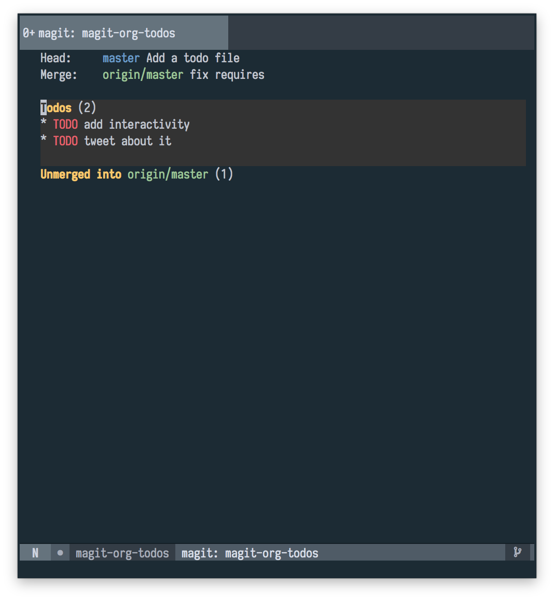

# magit-org-todos

Get `todo.org` into your magit status.

If you have a `todo.org` file with `TODO` items in the root of your
repository, `magit-org-todos` will create a section in your magit
status buffer with each of your todos.



## Usage

The recommended way to use `magit-org-todos` is with [`use-package`](https://github.com/jwiegley/use-package)

```elisp
(use-package magit-org-todos
  :config
  (magit-org-todos-autoinsert))
```

## Configuration

`magit-org-todos` exposes two main functions.

`magit-org-todos-autoinsert` automatically inserts a section into your
magit status buffer after the staged changes section.

If you want to insert it at a different location, use
`magit-add-section-hook` to insert `magit-org-todos-isnert-org-todos`

```elisp
(magit-add-section-hook
  'magit-status-sections-hook
  'magit-org-todos-insert-org-todos
  'magit-insert-staged-changes
  t))
```

## Contributing

Pull requests and issues welcome!
